<h1 align="center">Hi, I'm Pushpak Soni 👋</h1>
<h3 align="center">Data Engineer @ Cloudgritz | 3x GATE Qualified | Turning raw data into pipelines that just work</h3>

  

  

---

### 🚀 Projects

<table>
  <tr>
    <td width="25%">
      <b>🔧 Project Name</b> 
      Short one-line description goes here
    </td>
    <td width="25%">
      <b>🔧 Project Name</b> 
      Short one-line description goes here
    </td>
    <td width="25%">
      <b>🔧 Project Name</b> 
      Short one-line description goes here
    </td>
    <td width="25%">
      <b>🔧 Project Name</b> 
      Short one-line description goes here
    </td>
  </tr>
</table>

> ✏️ Send me your project names + one-line descriptions from your resume and I'll fill these in properly (no "Visit Site" links, matching the style you shared).

---

### 🧑‍💻 About Me

- 🔭 Currently working as a **Data Engineer at Cloudgritz**
- 🎓 **3x GATE Qualified**
- 💼 Ex-Intern at **PoolStack Technologies Pvt. Ltd.**
- 🧠 **150+ questions solved on LeetCode**
- 🎓 Graduated from **Rajiv Gandhi Proudyogiki Vishwavidyalaya (RGPV)**
- 📍 Based in **Gwalior, Madhya Pradesh, India**
- ⚡ Focused on building reliable, scalable **ETL pipelines** and data platforms

---

### 🛠️ Tech Stack

  
  
  
  
  
  
  
  

---

### 📊 GitHub Stats

  

  
  
  

> The old icon-stats and top-languages widgets both depend on GitHub's public API through a shared, unauthenticated Vercel instance — right now that backend is rate-limited (I confirmed this directly), so those two specific badges will keep breaking regardless of caching tricks. The streak card and shields.io badges above pull from a different, more stable path, so they render reliably. If you want the icon-stats/top-langs cards back permanently, the fix is self-hosting your own copy on Vercel with your own GitHub token — takes about 5 minutes and I can walk you through it.

---

### 🌐 Connect with Me

  
  
  

---

<i>Thanks for visiting my profile — always open to connecting on data engineering, pipelines, and cloud projects!</i>

